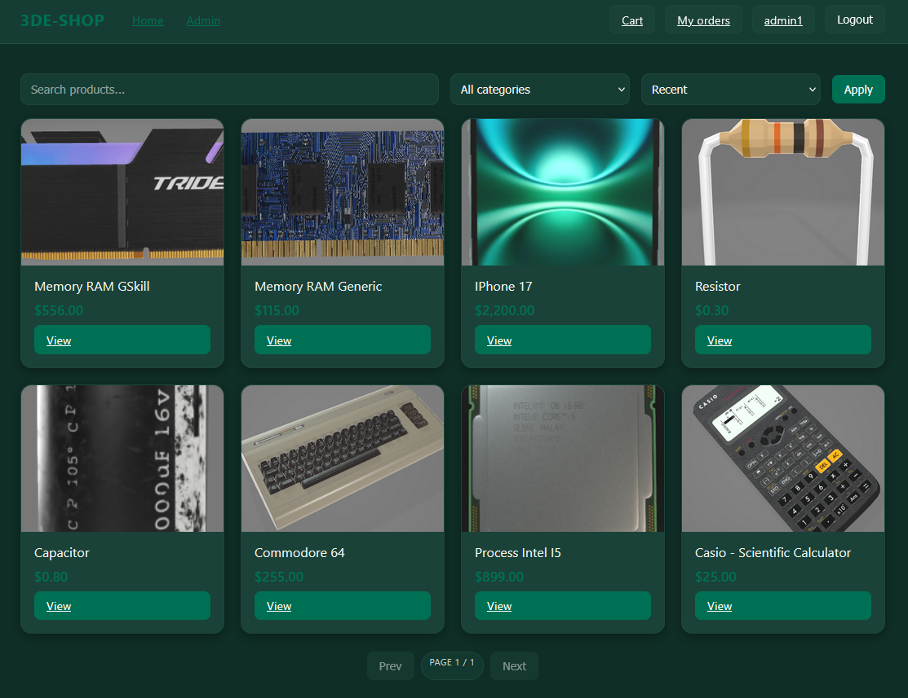
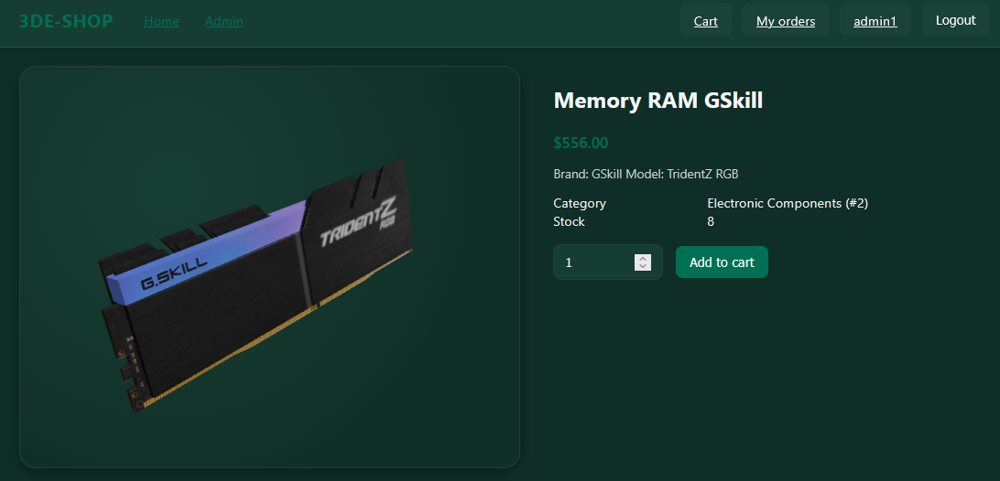
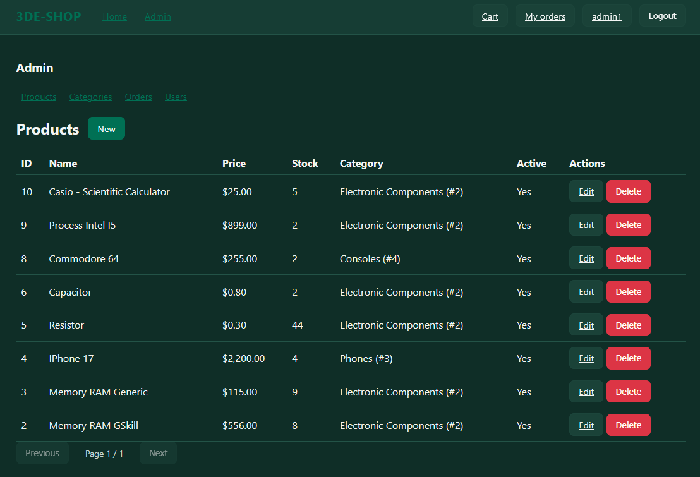

# 3DE‑SHOP Frontend

E‑commerce frontend with 3D product visualization (Three.js) and an admin dashboard. Built with Vite and vanilla ES modules; integrates with a Spring Boot backend.

## Features
- 3D product viewer (GLB/GLTF via three.js) with graceful fallbacks
- Auth (login/register/refresh/logout) and profile
- Cart, checkout, order history
- Admin: products, categories, users, orders (status updates)

## Tech Stack
- Vite 7, Vanilla JavaScript (ESM)
- three.js for 3D rendering

## Project Structure
```
src/
  api/          # HTTP client and endpoint wrappers
  components/   # Navbar, Pagination, ProductCard
  store/        # authStore (token, user info, events)
  utils/        # format, toast, file URL helpers
  views/        # Public + Admin pages (user/cart/auth + admin management)
  main.js       # App bootstrap: init auth, navbar render, global link handling
  router.js     # Hash router: route matching, auth/admin guards, backend down gating
  styles.css    # Theme, layout, components styling, skeletons
index.html      # Base HTML shell (mount points + script entry)
```

## Screenshots



